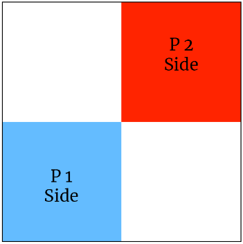

 <h1>Introduction Campaign</h1> 

This Campaign is composed of a single Quest that you can play multiple times and it’s the perfect game to test your abilities against your opponent.  
Guilds will grow in number and power. If played as Campaign, the Guild who won the third Guild Clash wins the Campaign.

Guild Clash
===========

Shields will be broken and souls will be shattered, as two Guildmasters are demonstrating their command skills on the battlefield.  

## Quest Map

## Main Objective

* The Guild who scores more Victory Points wins the Quest.

## Quest Rewards

* Quest Participation: +1 Guildhall Card.
* Quest Winner: +1 Guildhall Card
