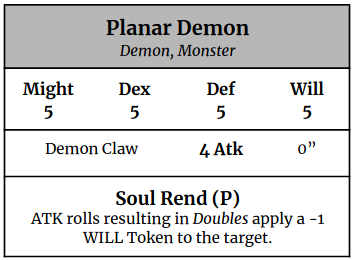

Dooms
=====

The hearts and courage of heroic models let
them face the toughest shocks, where any
other soldier or mercenary would yield or give
up. Withstanding brutal combat, witnessing
unspeakable terrors or through Arcane
Instability, Heroic models accumulate
Torment which eventually gain them Dooms.
Dooms are mental states that are often afflictions and rarely virtues.

## Torment Tokens (TT)

Torment Tokens, abbreviated as TT, represent a Hero, Heroic Mount or Heroic Beasts’s mental damage and pressure, in fact, regular models don’t use it.  
Torment Tokens can’t exceed the WILL score of a heroic model.
A heroic model (even Arcanists) who accumulates enough Torment Tokens to reach their WILL has to immediately roll a random Doom from the List.

## Sources of Torment

Torment Tokens are received by Heroes, Heroic Mounts or Heroic Beasts from a variety of situations and sources:

* Guildmasters accumulate 1 TT at the end of the Round if their Shouted Orders are not accomplished.
* When a model tagged Arcanist casts a Spell.
* By using an Active Abilities marked with a “(T)”, 1 TT is accumulated on the Model Card using it.
* Various Spells inflict TT instead of Wounds.
* Some specific Terrain, Quests Special Rules or Artifacts could inflict Torment Tokens.

## Doom Roll List

Heroic models are affected by collected Dooms until the end of the Campaign if you are playing one.
Otherwise, they last until the end of the current Game. Campaign sheets let you keep track of your heroic model's Dooms, which also come in Cards to collect.  
Once a heroic model rolls a Doom, the Torment Tokens are completely removed.
Heroic models can’t get more than 1 Doom.
When a heroic model affected by a Doom accumulates enough Torment Tokens to reach their Will he has to roll a random Doom from the list again.  
The new Doom assigned replaces the previously owned Doom, but if it turns out to be the same Doom already owned, the heroic model will be immediately Vanquished. 
Once your heroic model needs to roll to receive a Doom, roll 2D6, add the results together and consult on the table below.
Assign that Doom to the heroic model that made the roll.

### (2) Permanent Death

The heroic model is immediately removed from the game.  
If playing a Campaign the heroic model does not return for the next Quests.

### (3) Visionary

You see creepy things and hallucinations that sometimes lead you to act in an erratic manner.  
You are permanently Confused.

### (4) Hopeless 

You can’t perform Heroic Reactions (such as Dispel or Heroic Shield Block), and your DEF is lowered by 1.

### (5) Brutal

You want to witness violence.  
You must use your Activations to approach and Attack the nearest enemy model using the shorter route.
You can’t heal any Wound or Heroic Wound or Disengage.
If you have Abilities that inflict Wounds, you must use them on your enemies whenever possible.

### (6) Masochist

Whenever you fail any roll (Attack, Abilities, Spells, Characteristic Tests), you punish yourself and your Might is reduced by 1.

### (7) Kleptomaniac

You must spend your Activations trying to approach and get the nearest Treasure on the map, going through the shorter route from your point to it, risking the chance of engaging any enemy model you pass across.  
In Quests without Treasure this Doom has no effect.

### (8) Fearful

If you possess even a single Wound you can’t Engage enemies, and when you start your Activation Engaged you are forced to try a Disengage and move away from the opponent.  
During a WILL Test you always Roll 2 die and use the worst (higher) result.

### (9) Warrior’s Wit

You may Reroll any ATK dice and keep the best result.

### (10) Stalwart

You may Reroll any WILL Test and keep the best result. You are also immune to Terror.

### (11) Cunning

You may Reroll any DEX Test and keep the best result. You also Move 1” more.

### (12) Unstoppable

Your Willpower and Might is increased by 1.

### (\*) Possessed by a Planar Demon

This Doom is received through the Arcane Instability Test and can’t be normally rolled.  
You become controlled by a Planar Demon, who is an enemy to all Players and acts as a Wandering Monster (placing the Demon model in place of the Arcanist).
If the Planar Demon is Vanquished the Arcanist will return to its location and roll for a random Doom, it also loses the ability to cast Spells or Dispel till the end of the current Quest.

</img>
