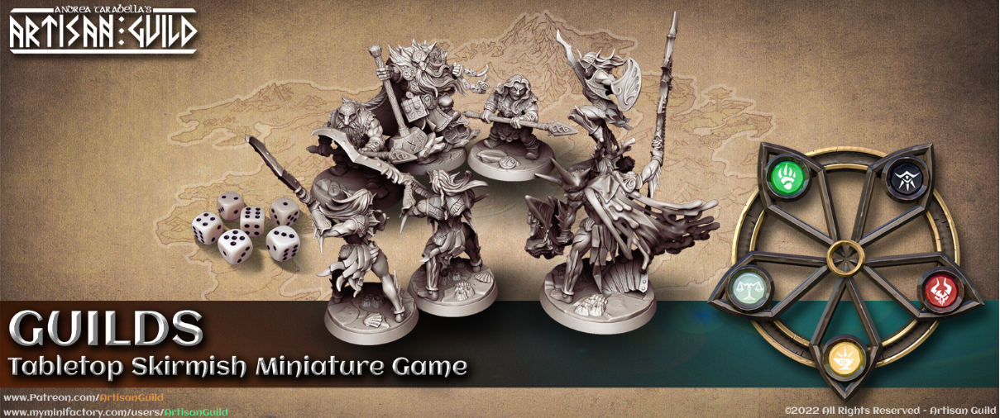

</img>

Alpha 0.802
===========
Thank you for participating in this ambitious project!  
We are really thankful that you decided to pick this manual and embark on this adventure with us.  
We hope you’ll have lots of fun!

Printable Cards for the Guild Upgrades, Spells, Heroes and Units will be added at a later stage.  
The temporary Factions Cards PDF is now separate from this rulebook.  

The 0.802 version has new and better conditions, elemental wounds and resistance, a system to track Heroes wounds.

A new Guildhall card called Arcane Forge is work in progress, but it already introduces the new Champion system to upgrade infantry and cavalry.  

We added a few Heroic Beast and Legendary Heroes, and we are looking to expand them as well.  
We are in the process of adding ALL Artisan Guild Factions into this game.  

Prepare your weapons, Guildmaster!

Introduction
============
Welcome to the universe of Artisan Guild!  

In GUILDS you play a powerful Guild in an intriguing Arcane world called Mundus, a place pervaded by legendary creatures and torn by war.  

Being the Guildmaster of a rising Guild, you will build your Guildhall, recruit units and lead  your warband to face gruesome battles against epic monstrosities and other rival Guilds.
As a legendary commander you have the power to inspire those who fight on your side.  

Advance through Quests, recruit mercenaries, warriors, arcanists and inspire more legendary characters to join your cause!  

Depending on your Guildmaster creed and virtues, you will inspire like minded armies and creatures to join your cause.  
Choose your allies wisely, as siding with certain factions will prevent you from recruiting the ones who do not share their vision of the world.  

```{toctree}
  :maxdepth: 4
  :caption: GUILDS
  :hidden:

content/wheel_of_forces
content/the_guildhall_deck
content/the_model_cards
content/the_dice
```

```{toctree}
  :maxdepth: 4
  :caption: Basics
  :hidden:

content/quick_guide
```

```{toctree}
  :maxdepth: 4
  :caption: Detailed Rules
  :hidden:

content/event_phase
content/activation_phase
content/movements
content/control_area
content/line_of_vision
content/attack_action
content/wounds
content/conditions
```
```{toctree}
  :maxdepth: 4
  :caption: Campaigns
  :hidden:

content/campaigns/intro
```

