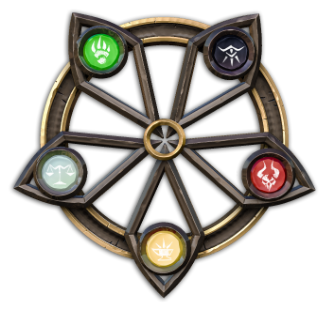

.. raw:: html

    
    
    
    
    

The Wheel of Forces
===================

When you choose the Guildmaster and the starting members of your Guild, you may pick cards and models from various factions.  
Characters and factions are subdivided into 5 major Forces, identified by a colored rune in the Wheel.

Every Force defines the principles of the factions who belong to it, their vision of the world, their goals and common beliefs.  
This doesn’t mean that all the factions and characters of the same Force know each other:  
some of them could belong to different cultures - or even worlds -, but at the very core their philosophy is similar, and it's up to you as Guildmaster to build bridges across them and find synergies.  

Not only you are able to pick characters from a single Force: as you expand your Guild you will be able to recruit units and creatures from other Forces.  

Here is a list of the five Forces.  
As you can see, there are some connections as you rotate the Wheel across Adjacent Forces:

.. role:: red
.. role:: yellow
.. role:: white
.. role:: black
.. role:: green

* **Fortitude** (:yellow:`Yellow`)
  | Resistance, Perseverance, Honor
* **Chaos** (:red:`Red`)
  | Instinct, Strength, Raid
* **Corruption** (:black:`Black`)
  | Oppression, Fear, Sacrifice
* **Order** (:white:`White`)
  | Justice, Law, Compassion
* **Wild** (:green:`Green`)
  | Wildlife, Growth, Survival
